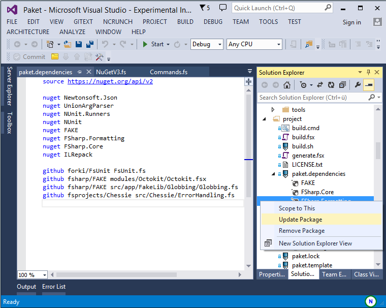
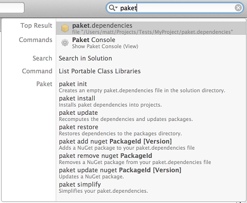

- title : FAKE and Paket
- description : Beautiful builds with F#
- author : Steffen Forkmann
- theme : black
- transition : default

***

## FAKE + Paket
 
#### Essential tools for every .NET developer

 

Steffen Forkmann

[@sforkmann](http://www.twitter.com/sforkmann)

***

### What is FAKE?

- Build tool for .NET and mono
- Plays well with existing ecosystem
- Simple domain-specific language integrated in F#

  

***

### Other build tools for .NET

- MSBuild
- NAnt
- UpperCut
- PSake (Powershell)
- AlbaCore (Rake)
- BauBuild, Cake (Roslyn)

***

### Why should I use FAKE?

***

### Why should I use FAKE?

***

### Why should I use FAKE?

***

### Why should I use FAKE?

***

### Why should I use FAKE?

***

### Why should I use FAKE?

***

### Who uses FAKE?

* msu solutions GmbH
* Octokit (by GitHub)
* E.On Global Commodities UK
* Deedle (by BlueMountainCapital)
* CHECK24 Vergleichsportal GmbH
* Olo
* ...

***

### Who uses FAKE?

* FSharp.Compiler.Service
* FSharp.Data
* FsCheck
* VFPT
* Paket
* Akka.net
* NSubstitute
* ...

***

### Getting Started

* Tutorial available at [fsharp.github.io/FAKE/](http://fsharp.github.io/FAKE/gettingstarted.html)

***

### Running FAKE

    @echo off
    cls
    .nuget/NuGet.exe Install FAKE -ExcludeVersion
    packages/FAKE/tools/Fake.exe build.fsx
    pause

or

    @echo off
    cls
    .paket/paket.exe restore
    packages/FAKE/tools/Fake.exe build.fsx
    pause

***

### Hello world

    // include Fake lib
    #r @"packages/FAKE/tools/FakeLib.dll"
    open Fake

    // Default target
    Target "Default" (fun _ ->
        trace "Hello World from FAKE"
    )

    // start build
    RunTargetOrDefault "Default"

***

### Hello world

***

### Cleaning up

    let buildDir = "./build/"

    // Targets
    Target "Clean" (fun _ ->
        CleanDir buildDir
    )

    // Dependencies
    "Clean"
      ==> "Default"

***

### Cleaning up

***

### Compiling the application

    Target "BuildApp" (fun _ ->
        !! "src/app/**/*.csproj"
          |> MSBuildRelease buildDir "Build"
          |> Log "AppBuild-Output: "
    )

    // Dependencies
    "Clean"
      ==> "BuildApp"
      ==> "Default"

***

### Compiling the application

***

### Compiling test projects

    Target "BuildTest" (fun _ ->
        !! "src/test/**/*.csproj"
          |> MSBuildDebug testDir "Build"
          |> Log "TestBuild-Output: "
    )

    "Clean"
      ==> "BuildApp"
      ==> "BuildTest"
      ==> "Default"

***

### Running tests

    Target "Test" (fun _ ->
        !! (testDir </> "NUnit.Test.*.dll")
          |> NUnit (fun p ->
              {p with
                 // override default parameters
                 DisableShadowCopy = true;
                 OutputFile = testDir </> "TestResults.xml" })
    )

    "Clean"
      ==> "BuildApp"
      ==> "BuildTest"  
      ==> "Test"
      ==> "Default"

***

### Running tests

***

### Running tests (in parallel)

    Target "Test" (fun _ ->
        !! (testDir </> "NUnit.Test.*.dll")
          |> NUnitParallel (fun p ->
              {p with
                 DisableShadowCopy = true;
                 OutputFile = testDir </> "TestResults.xml" })
    )

    "Clean"
      ==> "BuildApp"
      ==> "BuildTest"  
      ==> "Test"
      ==> "Default"

***

### Running tests (xUnit)

    Target "Test" (fun _ ->
        !! (testDir </> "xUnit.Test.*.dll")
          |> xUnit2 (fun p ->
              {p with OutputDir = testDir })
    )

    "Clean"
      ==> "BuildApp"
      ==> "BuildTest"  
      ==> "Test"
      ==> "Default"

***

### Adding FxCop

    Target "FxCop" (fun () ->  
        !! (buildDir </> "**/*.dll")
        ++ (buildDir </> "**/*.exe")
        |> FxCop
            (fun p ->
                {p with ReportFileName =
                  testDir </> "FXCopResults.xml" })
    )

***

### Create AssemblyInfo files

    open Fake.AssemblyInfoFile

    CreateCSharpAssemblyInfo
        "./src/app/Calculator/Properties/AssemblyInfo.cs"
        [Attribute.Title "Calculator Command line tool"
         Attribute.Description "Sample project for FAKE"
         Attribute.Guid "A539B42C-CB9F-4a23-8E57-AF4E7CEE5BAA"
         Attribute.Product "Calculator"
         Attribute.Version version
         Attribute.FileVersion version]

***

### Creating NuGet packages

    NuGet (fun p ->
        {p with
            Authors = authors
            Project = projectName
            Description = projectDescription
            OutputPath = packagingRoot
            Summary = projectSummary
            WorkingDir = packagingDir
            Version = buildVersion
            AccessKey = myAccesskey
            Publish = true })
            "myProject.nuspec"

***

### Creating NuGet packages

    [lang=xml]
    <?xml version="1.0" encoding="utf-8"?>
    <package xmlns:xsi="http://www.w3.org/2001/XMLSchema-instance" xmlns:xsd="http://www.w3.org/2001/XMLSchema">
      <metadata xmlns="http://schemas.microsoft.com/packaging/2010/07/nuspec.xsd">
        <id>@project@</id>
        <version>@build.number@</version>
        <authors>@authors@</authors>
        <owners>@authors@</owners>
        
@summary@

        <licenseUrl>https://github.com/octokit/octokit.net/blob/master/LICENSE.txt</licenseUrl>
        <projectUrl>https://github.com/octokit/octokit.net</projectUrl>
        <iconUrl>https://github.com/octokit/octokit.net/icon.png</iconUrl>
        <requireLicenseAcceptance>false</requireLicenseAcceptance>
        <description>@description@</description>
        <releaseNotes>@releaseNotes@</releaseNotes>
        <copyright>Copyright GitHub 2013</copyright>
        <tags>GitHub API Octokit</tags>
        @dependencies@
        @references@
      </metadata>
      @files@
    </package>

***

### Creating NuGet packages (using Paket)

      Target "NuGet" (fun _ ->
          Paket.Pack (fun p ->
              { p with
                  Version = release.NugetVersion
                  ReleaseNotes = toLines release.Notes })
      )

      Target "PublishNuGet" (fun _ ->
          Paket.Push (fun p ->
              { p with
                  WorkingDir = tempDir })
      )

***

# DEMO

***

### What is Paket?

- Dependency manager for all .NET and Mono projects
- Plays well with NuGet packages and [nuget.org](http://www.nuget.org)
- Allows to reference code files from HTTP and GitHub

  

***

### Why another package manager?

- .NET ecosystem has already NuGet
- Integrated in Visual Studio and Xamarin Studio
- [nuget.org](https://www.nuget.org/) is etablished package feed

  

***

### Why another package manager?

- NuGet has no global view of your dependencies
- `packages.config` files are spread over all projects
- As a sample [MassTransit](https://github.com/MassTransit/MassTransit):

 

***

### Why another package manager?

- NuGet has no concept of transitive dependencies

    <?xml version="1.0" encoding="utf-8"?>
    <packages>
      <package id="Accord" version="2.14.0" targetFramework="net45" />
      <package id="Accord.Math" version="2.14.0" targetFramework="net45" />
      <package id="Accord.Neuro" version="2.14.0" targetFramework="net45" />
      <package id="AForge" version="2.2.5" targetFramework="net45" />
      <package id="AForge.Genetic" version="2.2.5" targetFramework="net45" />
      <package id="AForge.Math" version="2.2.5" targetFramework="net45" />
      <package id="AForge.Neuro" version="2.2.5" targetFramework="net45" />
      <package id="Deedle" version="1.0.1" targetFramework="net45" />
      <package id="Deedle.RPlugin" version="1.0.1" targetFramework="net45" />
      <package id="FSharp.Charting" version="0.90.6" targetFramework="net45" />
      <package id="FSharp.Data" version="2.0.9" targetFramework="net45" />
      <package id="FsLab" version="0.0.19" targetFramework="net45" />
      <package id="MathNet.Numerics" version="3.0.0" targetFramework="net45" />
      <package id="MathNet.Numerics.FSharp" version="3.0.0" targetFramework="net45" />
      <package id="R.NET.Community" version="1.5.15" targetFramework="net45" />
      <package id="R.NET.Community.FSharp" version="0.1.8" targetFramework="net45" />
      <package id="RProvider" version="1.0.13" targetFramework="net45" />
    </packages>

***

### Why another package manager?

- NuGet puts the package version in the path
- Updates require manual work (at least if you use .fsx):

    #I "packages/Deedle.1.0.1/lib/net40"
    #I "packages/Deedle.RPlugin.1.0.1/lib/net40"
    #I "packages/FSharp.Charting.0.90.6/lib/net40"
    #I "packages/FSharp.Data.2.0.9/lib/net40"
    #I "packages/MathNet.Numerics.3.0.0/lib/net40"
    #I "packages/MathNet.Numerics.FSharp.3.0.0/lib/net40"
    #I "packages/RProvider.1.0.13/lib/net40"
    #I "packages/R.NET.Community.1.5.15/lib/net40"
    #I "packages/R.NET.Community.FSharp.0.1.8/lib/net40"

***

### Why another package manager?

- NuGet doesn't allow to reference plain source files
- If you want to reuse code you have to create a package

***

### Why don't you contribute to NuGet?

- NuGet is open source, but managed by Microsoft
- Most of changes are breaking (e.g. no version no. in path)
- NuGet team made clear they won't accept these changes

***

### Paket - Project Principles

- Integrate well into the existing NuGet ecosystem
- Make things work with minimal tooling (plain text files)
- Make it work cross-platform
- Automate everything
- Create a nice community

***

### Paket file structure

- `paket.dependencies`: Global dependency definition
- `paket.lock`: List of used versions for all dependencies
- `paket.references`: Dependency definition per project
- `paket.template`: Package definition for new packages

***

### paket.dependencies

- Specifies all direct dependencies
- Manually editable (or via paket.exe commands)

    [lang=paket]
    source https://nuget.org/api/v2

    nuget Newtonsoft.Json         // any version
    nuget UnionArgParser >= 0.7   // x >= 0.7
    nuget log4net ~> 1.2          // 1.2 <= x < 2
    nuget NUnit prerelease        // any version incl. prereleases

***

### paket.lock

- Graph of used versions for all dependencies
- Compareable to a unified view of all `packages.config`
- Automatically computed from `paket.dependencies`:

    [lang=paket]
    NUGET
      remote: https://nuget.org/api/v2
      specs:
        log4net (1.2.10)
        Microsoft.Bcl (1.1.9)
          Microsoft.Bcl.Build (>= 1.0.14)
        Microsoft.Bcl.Async (1.0.168) - >= net40 < net45
          Microsoft.Bcl (>= 1.1.8)
        Microsoft.Bcl.Build (1.0.21)
        Newtonsoft.Json (6.0.8)
        NUnit (3.0.0-alpha-4)
          Microsoft.Bcl.Async (>= 1.0.165) - >= net40 < net45
        UnionArgParser (0.8.2)

***

### paket.references

- Specifies which dependencies are used in a given project
- Compareable to `packages.config`, but without versions
- Only direct dependencies need to be listed
- Manually editable

    [lang=paket]
    Newtonsoft.Json
    UnionArgParser
    NUnit

***

### Installing packages

    $ paket install

- Computes `paket.lock` based on `paket.dependencies`
- Restores all direct and transitive dependencies
- Processes all projects and adds references to the libraries

***

### Checking for updates

    $ paket outdated

- Lists all dependencies that have newer versions available:

  

***

### Updating packages

    $ paket update

- Recomputes `paket.lock`
- Updates all versions to the latest
- Runs `paket install`

***

### Updating a single package

    $ paket update nuget [PACKAGENAME]

- Updates only the given package and it's dependencies
- Runs `paket install`

***

### Restoring packages

    $ paket restore

- Restores all direct and indirect dependencies
- Will not change `paket.lock` file
- Can be used for CI build or from inside Visual Studio

***

### Convert from NuGet

    $ paket convert-from-nuget

- Finds all `packages.config` files
  - Converts them to `paket.references` files
  - Generates `paket.dependencies` file
  - Computes `paket.lock` file
- Visual Studio package restore process will be converted
- Runs `paket install`

***

### Simplify dependencies

    $ paket simplify

- Computes transitive dependencies from `paket.lock` file  
  - Removes these from `paket.dependencies`
  - Removes these `paket.references`
- Especially useful after conversion from NuGet ([Sample](http://fsprojects.github.io/Paket/paket-simplify.html#Sample))

***

### Bootstrapping

- Don't commit `paket.exe` to your repository
- Bootstrapper is available for [download](https://github.com/fsprojects/Paket/releases/latest)
- Bootstrapper allows to download latest `paket.exe`
- Can be used for CI build or from inside Visual Studio

***

### Source code dependencies

- Allow to reference plain source code files
- Available for:
  - [GitHub](https://www.github.com)
  - [GitHub gists](https://gist.github.com/)
  - HTTP resources

***

### Source code dependencies
#### GitHub sample (1)

- Add dependency to the `paket.dependencies` file

    [lang=paket]
    github forki/FsUnit FsUnit.fs

- Also add a file reference to a `paket.references` file

    [lang=paket]
    File:FsUnit.fs

***

### Source code dependencies
#### GitHub sample (2)

- `paket install` will add a new section to `paket.lock`:

    [lang=paket]
    GITHUB
      remote: forki/FsUnit
      specs:
        FsUnit.fs (7623fc13439f0e60bd05c1ed3b5f6dcb937fe468)

- `paket install` will also add a reference to the project:

  

***

### Source code dependencies
#### Use case - "Type Provider definition"

- For F# Type Providers you need a couple of helper files
- It was painful to keep these up-to-date
- Reference Type Provider files in `paket.dependencies`:

    [lang=paket]
    github fsprojects/FSharp.TypeProviders.StarterPack src/ProvidedTypes.fsi
    github fsprojects/FSharp.TypeProviders.StarterPack src/ProvidedTypes.fs
    github fsprojects/FSharp.TypeProviders.StarterPack src/DebugProvidedTypes.fs

- Add the files to the Type Provider's `paket.references`:

    [lang=paket]
    File:ProvidedTypes.fsi
    File:ProvidedTypes.fs
    File:DebugProvidedTypes.fs

***

### Dependency Groups

- allow for better organization of dependencies
- enable easier conflict resolution

    [lang=paket]
    source https://nuget.org/api/v2
    
    nuget Newtonsoft.Json    
    github forki/FsUnit FsUnit.fs
    
    group Build
        source https://nuget.org/api/v2
        nuget FAKE    
        github fsharp/FAKE modules/Octokit/Octokit.fsx
    
    group Test
        source https://nuget.org/api/v2
        nuget NUnit
        nuget NUnit.Runners ~> 2

***

### Dependency Groups (paket.lock)

    [lang=paket]
    NUGET
      remote: https://nuget.org/api/v2
      specs:
        Newtonsoft.Json (7.0.1)
    GITHUB
      remote: forki/FsUnit
      specs:
        FsUnit.fs (81d27fd09575a32c4ed52eadb2eeac5f365b8348)
    GROUP Build
    NUGET
      remote: https://nuget.org/api/v2
      specs:
        FAKE (4.3.1)
        ...
    GROUP Test
    NUGET
      remote: https://nuget.org/api/v2
      specs:
        NUnit (2.6.4)
        NUnit.Runners (2.6.4)
        
***

### Getting help

    $ paket [command] --help

- Visit the [online documentation](http://fsprojects.github.io/Paket/)
- Create a [GitHub issue](https://github.com/fsprojects/Paket/issues)
- Follow [PaketManager](https://twitter.com/PaketManager) on Twitter

***

### Paket.VisualStudio

- [VisualStudio plugin](https://github.com/hmemcpy/Paket.VisualStudio)

 

***

### Paket.XamarinStudio

- [Xamarin Studio plugin](http://addins.monodevelop.com/)

 

***

### Paket.Atom

-  Available in [Atom's plugin manager](https://atom.io/packages/paket)

 

***

### Paket.VSCode

-  Available in [VSCode's plugin manager](https://code.visualstudio.com/docs/editor/extension-gallery)

 

***

### Paket.Emacs

- Project site: [https://github.com/zzdtri/paket.el](https://github.com/zzdtri/paket.el)

 

***

### ProjectScaffold

- Used to initialialize a prototypical .NET/mono solution
- Fully featured Paket + FAKE build process
- http://fsprojects.github.io/ProjectScaffold/

   

***

### ProjectScaffold

- Allows a simple one step build and release process
- Works with most build servers
- Compiles the application and runs all test projects
- Synchronizes AssemblyInfo files prior to compilation
- Generates API docs based on XML documentation
- Generates documentation based on Markdown files
- Generates and pushes NuGet packages

***

### Thank you

- Take a look at https://github.com/fsharp/FAKE
- Take a look at https://github.com/fsprojects/Paket
- We take contributions!
- Slides are MIT licensed and made using [FsReveal](http://fsprojects.github.io/FsReveal/)
- Send corrections to https://github.com/forki/FAKE.Intro
- Follow [@fsharpMake](https://twitter.com/fsharpMake)
- Follow [@PaketManager](https://twitter.com/PaketManager)
